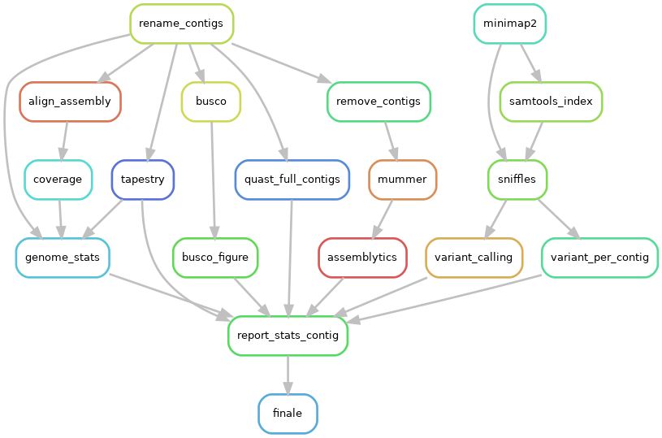
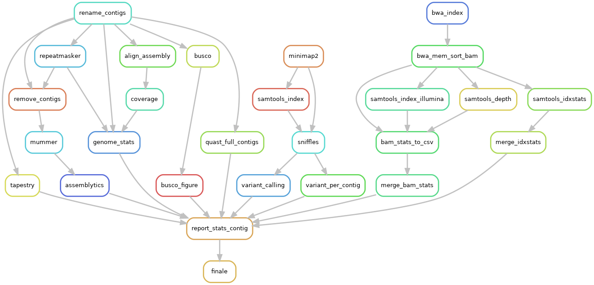

Today, assembly a genome using long reads from either Oxford Nanopore Technologies or Pacific Biosciences is really powerful, in particular to solve repeats and structural variants, for prokaryotic as well as for eukaryotic genomes. Such technologies provide assemblies that are increased in contiguity and accuracy.

Due to the daily deluge of data sequences and the increasing number of released tools that are even updated every week, many species see having their genome assembled in almost chromosome-scale, and that’s great...

However a huge question remains:

*"But which assembly tool will provide the best result for your favorite organism?"*

To that anguishing idea, we can answer: **PodiumASM can help you!**

PodiumASM is is an open-source, scalable, modulable and traceable snakemake pipeline, able to compare multiple long read assemblies obtained from multiple assemblers tools. The workflow PodiumASM can help you to choose the best assemblies among all possibilities.

Optional rule can be activate or not according to user’s requests in PodiumASM. PodiumASM also generates a report compiling information obtained at each step, to help user to decide which assembly results to work with.

.. contents:: Table of Contents
   :depth: 2
   :backlinks: entry

Quality Control of assemblies
-----------------------------

A variety of useful tools are implemented to check the accuracy of assemblies.

PodiumASM checks the quality of the assemblies with using these tools:

.. note::
   * BUSCO: helps to check if you have a good assembly, by searching the expected single-copy lineage-conserved orthologs in any newly sequenced genome from an appropriate phylogenetic clade.
   * QUAST: a good starting point to evaluate the quality of assemblies, provides many helpful contiguity statistics and metrics.
   * TAPESTRY: allows to detect telomere on assembled contigs.
   * Assemblytics: compares structural variations of assemblies versus a reference genome
   * MINIMAP2: allow mapping of refference genome against long_read of organism
   * Sniffle : descriptive information about the number of structural variation on the assembly

Included tools :

* BUSCO version >= 4.0.5
* QUAST version >= 5.0.2
* TAPESTRY version >= 1.1.1
* Assemblytics version >= 1.2
* MINIMAP2 version >= 1.2
* Sniffle version>= 1.10

Optional ILLUMINA step
......................

You can activate or deactivate ILLUMINA step; if you have short reads ILLUMINA of your organims then switch to *ILLUMINA=True* in the ``config.yaml``  file.

Directed acyclic graphs (DAGs) show the differences between deactivated (ILLUMINA=False):

and activated ILLUMINA step on configuration file (ILLUMINA=True):

ILLUMINA rule will calculates remapping stats using Illumina reads over assemblies
